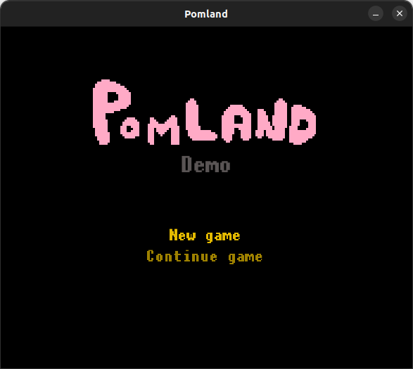
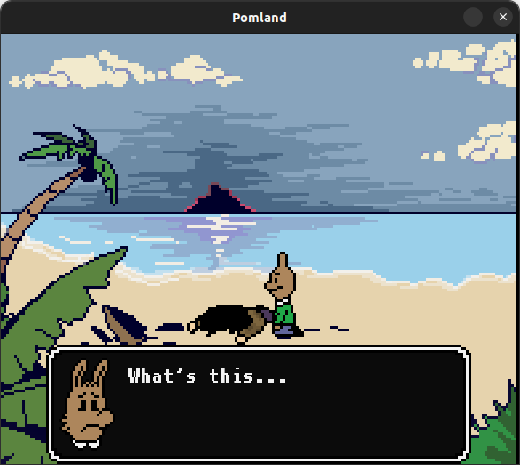
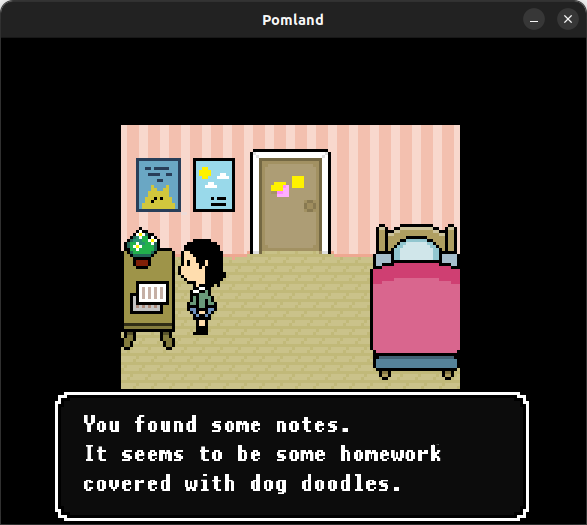
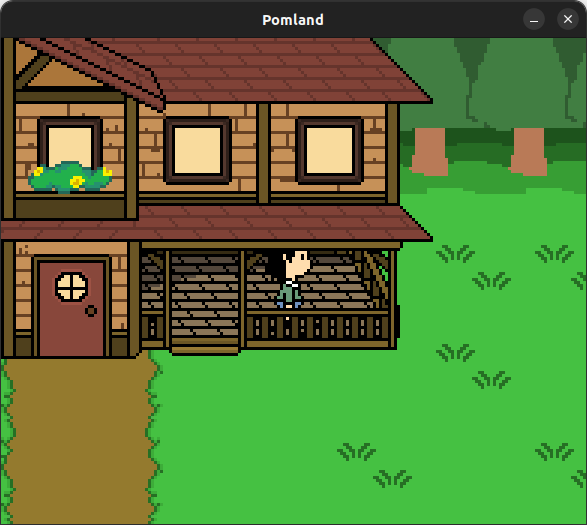

# Pomland
## What is this?
This is a new public repository for my first ever C++ project, which I started to write in february of 2016.
It is an unfinished RPG game heavily inspired by Undertale and Earthbound. 
My friend Noah Adolfsson Hall, who is a very talented animator and artist, is the one who came up with the original idea.
He had drawn some concept pixel art and wanted to make a game out of it. 
I had recently learned some JavaScript, so I thought I could learn what I needed to program the game.

Most of the art was made by Noah, except for some backgrounds which were made by our friend and skilled artist Linnéa Tjernström. 
The code was developed and reworked multiple times during the years 2016 and 2017 as I learned from my mistakes and came up with new ideas. 
Most of the code is left unchanged since then (and is thus very bad C++ code written by a beginner to the language), but some new changes have also been made to add CMake support and make it work with recent SFML versions and different compilers.

The game was never finished, only 11 scenes (6 in-game rooms) were made until we had enough and pursued other projects instead.

## Screenshots

